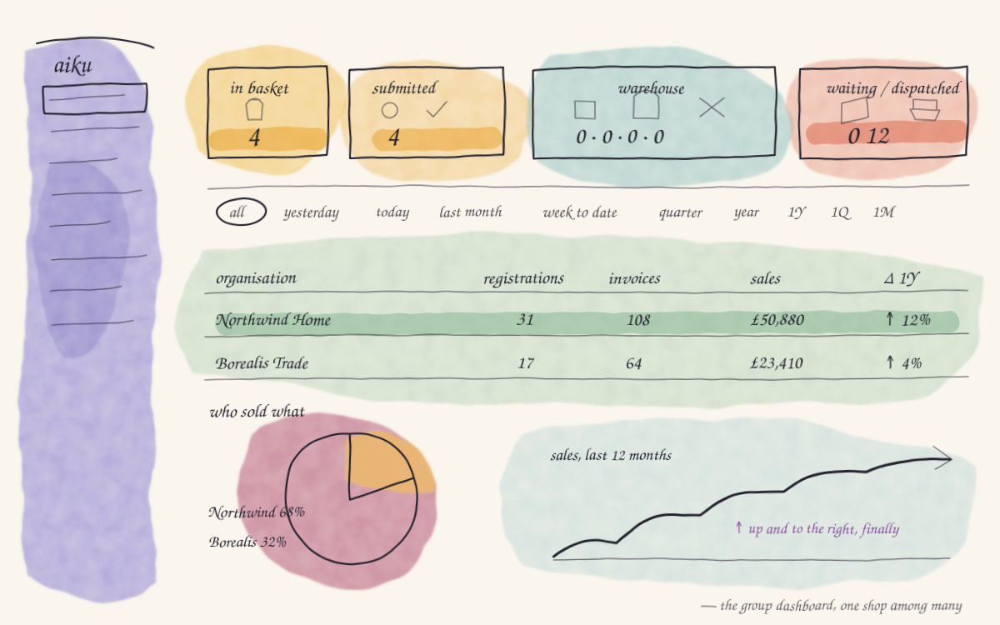
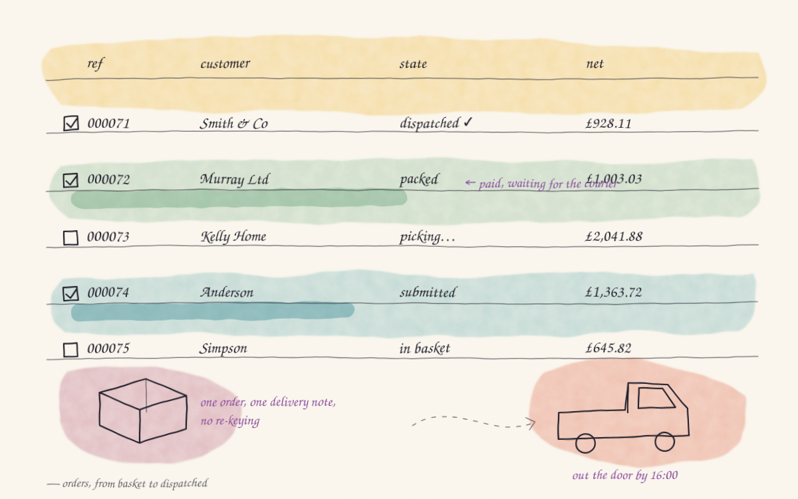
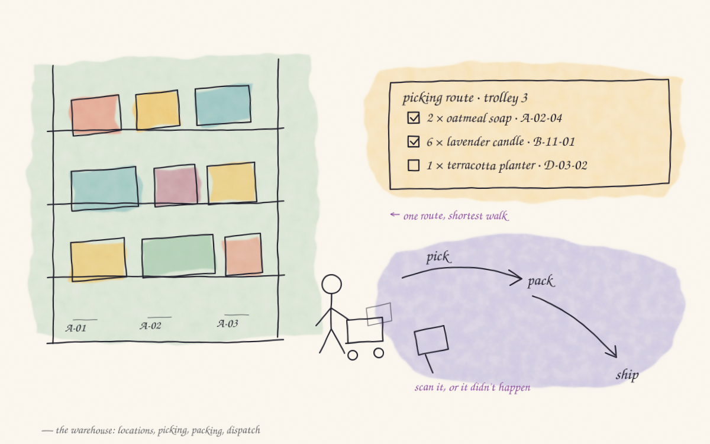
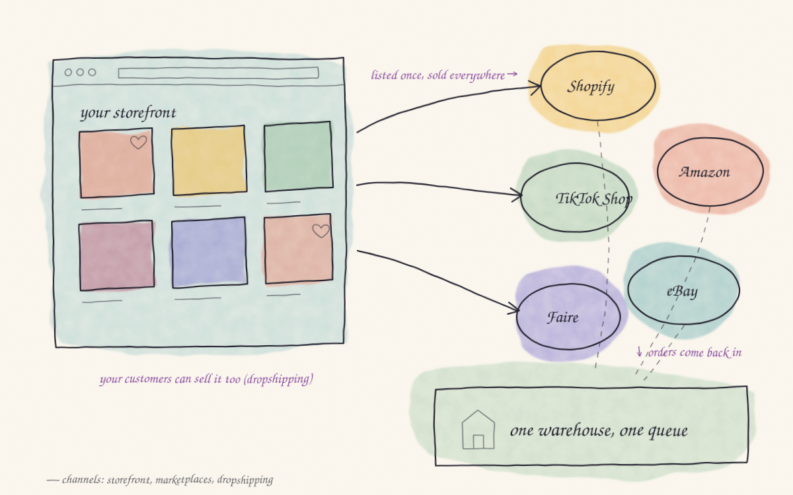
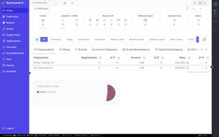
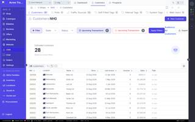
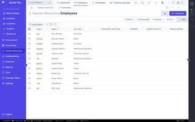
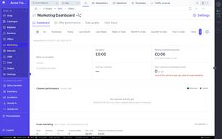

<p align="center">
  
</p>

<h1 align="center">aiku</h1>

<h3 align="center">The open source operating system for commerce.</h3>

<p align="center"><a href="https://aiku.io">aiku.io</a> · <a href="https://aiku.io/blog">Engineering notes</a></p>

<p align="center">
  One platform to run wholesale, retail, dropshipping, marketplaces, 3PL fulfilment and your own storefronts —<br>
  across many companies, warehouses, countries and currencies.
</p>

<p align="center">
  <a href="https://github.com/Inikoo-Ltd/aiku/actions/workflows/testing.yml"></a>
  <a href="https://codecov.io/gh/Inikoo-Ltd/aiku"></a>
  <a href="https://sonarcloud.io/summary/new_code?id=Inikoo-Ltd_aiku"></a>
  <a href="https://app.codacy.com/gh/Inikoo-Ltd/aiku/dashboard"></a>
  <a href="LICENSE"></a>
</p>

<p align="center">
  
</p>

---

## Why aiku

Most businesses glue together an ERP, a WMS, a shop platform, a marketplace connector, a mailing tool and a CRM — then spend their lives reconciling them. aiku is all of those, built as **one system with one source of truth**: a product is defined once and sold everywhere, stock moves once and every channel knows, a customer is one record whether they bought on your website, on Amazon or through your sales team.

It is not a demo. aiku runs real multi-country wholesale and retail operations in production every day, and it's released under the AGPL so you can run it too.

## Everything, in one place

### 🏢 Multi-entity by design
One **group**, many **organisations**, **shops**, **warehouses** and **brands**. Share masters, stock and staff across entities; keep pricing, tax, invoicing and websites separate per market. Multi-currency with live exchange rates, multi-language everywhere.

### 🧩 Masters & catalogue
Define products once at group level — master products, families, departments, trade units, barcodes, ingredients and GPSR data — and publish them to as many shop catalogues as you like, each with its own pricing, RRPs and availability.

### 🛒 Ordering & billing
B2B and B2C orders, baskets, pricing rules, offers and discounts, customer credit, VAT handling, invoices, credit notes, refunds, proformas. Orders flow straight into the warehouse without re-keying.

<p align="center"></p>

### 🏭 Warehouse & dispatch
Locations, stock levels, stock valuation, lost & found. Delivery notes, picking routes and picking sessions, packing benches, boxes, trolleys, label printers — and a handheld app for the floor. Carrier APIs built in: **DPD** (GB, SK), **GLS** (ES, SK incl. cash on delivery), **APC**, **CTT**, **Packeta**, **ITD**.

<p align="center"></p>

### 📦 Procurement & goods in
Suppliers and agents, purchase orders, stock deliveries, supplier products, landed cost.

### 🏗️ 3PL fulfilment
Run a fulfilment business for third parties: pallet storage, pallet deliveries and returns, stored items, recurring billing and fulfilment invoicing, with a customer portal for your 3PL clients.

### 🔗 Dropshipping & marketplaces
Let your customers sell your catalogue on their own channels — or sell it yourself — with two-way sync of products, orders and shipments:

<p align="center">
  &nbsp;&nbsp;&nbsp;
  &nbsp;&nbsp;&nbsp;
  &nbsp;&nbsp;&nbsp;
  &nbsp;&nbsp;&nbsp;
  &nbsp;&nbsp;&nbsp;
  &nbsp;&nbsp;&nbsp;
  
</p>

Plus **Faire** wholesale marketplace integration and a manual channel for everything else.

<p align="center"></p>

### 🌐 Websites & storefronts
A built-in CMS and storefront engine: drag-and-drop web blocks, banners, announcements, menus, merchandised search, SEO, GDPR pages, unsubscribe handling — server-side rendered and cached for speed. Launch a new shop website without touching code.

### 👥 Customer portal
Self-service for B2B, dropshipping and fulfilment customers: orders, invoices, pallets, channel connections, saved cards, top-ups, API keys.

### 💬 CRM, marketing & comms
Customers, prospects, web users, reviews, polls, back-in-stock reminders. Transactional and marketing email with a visual editor (BeeFree), mailshots, outboxes, SES delivery tracking. Live customer chat and internal staff chat. Marketing attribution by traffic source.


### 💳 Accounting & payments
Payments, payment accounts and gateways — Checkout.com, PayPal, Braintree, Hokodo, Pastpay, bank transfer, cash on delivery — invoice categories, top-ups, financial reports.

### 🧑‍💼 Human resources & production
Employees, clocking machines, timesheets, leave, job positions and roles. A manufacture module for artefacts, raw materials and job orders.

### 📊 Analytics, search & AI
Time-series metrics and dashboards, margins, exports. Group-wide instant search (Typesense / Meilisearch) and semantic search (pgvector). A first-party **MCP server** with permission-scoped tools so your AI assistants can answer questions about the business — safely.

## Yes, it's real

<p align="center">
  
  
  
  
  
  
  
  
</p>
<p align="center"><sub>Screens from a demo group seeded with random data — regenerate with <code>devops/devel/readme_screenshots.sh</code>.</sub></p>

## The apps

| App | For | Built with |
|---|---|---|
| **Staff back office** | Operations, sales, warehouse, accounting, HR | Laravel · Inertia · Vue 3 |
| **Customer portal** | B2B, dropshipping and fulfilment customers | Laravel · Inertia · Vue 3 |
| **Storefronts / CMS** | Public shop websites | Laravel · Inertia · Vue 3 (SSR) |
| **Shopify embedded app** | Dropshipping channel setup | Laravel · Inertia · Vue 3 |
| **Warehouse handheld** | Picking, packing, scanning | React Native |
| **Staff mobile** | Clocking, tasks, chat | React Native |

## Under the hood

**PHP 8.4 · Laravel 13 · Octane · Horizon · Passport · Pennant · Scout · laravel/mcp · PostgreSQL 18 + pgvector · Redis · Typesense · Meilisearch · Vue 3 · Inertia v2 · Tailwind · Vite · TypeScript · React Native · Pest 4**

## Getting started

```bash
composer install
npm install
cp .env.example .env && php artisan key:generate
php artisan migrate --seed
npm run dev
```

```bash
php artisan test --compact
```

## Contributing

Pull requests are welcome. See [CODE_OF_CONDUCT.md](CODE_OF_CONDUCT.md) and [SECURITY.md](SECURITY.md).

## License

GNU AGPLv3 — see [LICENSE](LICENSE).

Copyright (C) Raul A Perusquia Flores
