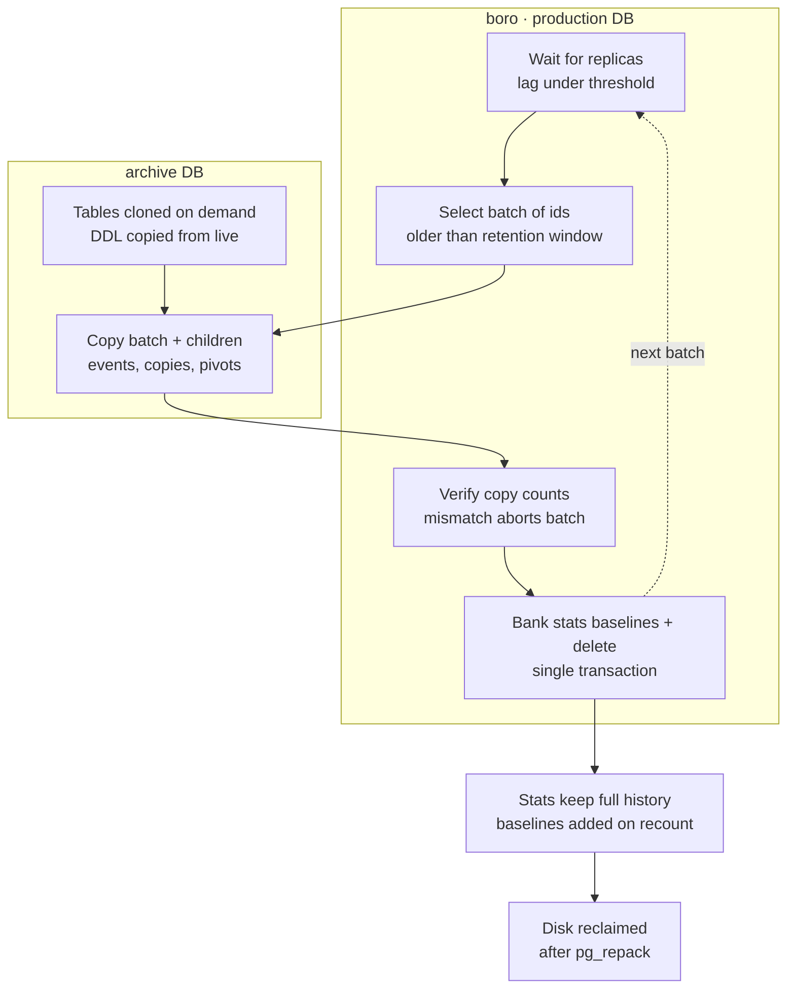

# Email log archiving

Moving old dispatched email data off boro (production) to an archive Postgres database, so the
operational database shrinks and the daily aggregation queries get cheaper. Written 15 August 2026,
alongside the archiver itself. Step 1 (stats baselines and the time series retention clamp) shipped
in [PR #2558](https://github.com/Inikoo-Ltd/aiku/pull/2558).

## Why

boro is 489 GB and the email stack is ~217 GB of it: `dispatched_emails` at 245M rows / 107 GB,
`email_tracking_events` at 332M rows / 61 GB, plus the cascade children (`mailshot_has_*` ~20 GB,
`email_copies` ~14 GB of full email bodies, `customer_has_*` ~12 GB). Data goes back to May 2018
and had never been pruned.

The real cost is not human lookups (customer timeline reads are ~71/day, negligible) but machine
aggregation: the `ProcessOutboxTimeSeriesRecords` daily rollup measured 23,863 calls and 9.1 hours
of DB time over 30 days. Shrinking the table is a performance win as much as a disk win.

## What the archiver does

`comms:archive_dispatched_emails` in
`app/Actions/Comms/DispatchedEmail/ArchiveDispatchedEmails.php`.



Per batch (default 5,000 emails), until no rows older than the cutoff remain:

1. **Wait for replicas.** If any replica in `pg_stat_replication` is further behind than
   `EMAIL_ARCHIVE_MAX_REPLICATION_LAG_MB` (default 256), the archiver sleeps. Bulk deletes generate
   WAL faster than helio can replay it; an unbounded backlog is what once filled boro's disk.
2. **Select** the next batch of `dispatched_emails.id` where `created_at` is older than
   `EMAIL_RETENTION_DAYS`.
3. **Copy to the archive.** The batch's rows plus every child table are inserted on the archive
   connection. Child tables are discovered live from `pg_constraint` (every FK pointing at
   `dispatched_emails`), not a hardcoded list — currently `email_tracking_events`, `email_copies`
   and the 13 `*_has_dispatched_emails` pivots. Archive tables are created on first use by cloning
   the live table's column definitions and primary key. The copy is idempotent
   (delete-then-insert per batch), so a crashed run simply redoes its batch.
4. **Verify.** Source and archive row counts are compared per table for the batch. Any mismatch
   throws and nothing on boro is touched.
5. **Bank baselines and delete, in one transaction.** The archived counts are merged into each
   affected outbox / mailshot / bulk run's `archived_dispatched_emails` jsonb baseline, the
   non-cascading children are deleted, then the emails themselves (the pivots cascade). Doing both
   in one transaction is load-bearing — see the next section.

Options: `--chunk=` batch size, `--limit=` stop after N emails (for a supervised first run),
`--dry-run` count only.

## Why the baselines exist

Every dispatched email counter in the app is a fresh `count()` over the raw rows
(`MailshotHydrateDispatchedEmails`, `OutboxHydrateDispatchedEmails`, the `EmailBulkRun` pair).
Delete rows and the next hydration silently rewrites historical stats with post-deletion numbers —
no error, just wrong figures discovered much later.

So each stats row carries a nullable `archived_dispatched_emails` jsonb map, keyed by the stats
column it feeds (`number_dispatched_emails`, `number_dispatched_emails_state_sent`,
`number_delivered_open_success`, …). The hydrators add the baseline on top of every recount via the
`WithArchivedDispatchedEmails` trait. The archiver increments those baselines in the same
transaction as the delete, so a hydration at any moment reports the full historical figure.

The same class of bug exists in `ProcessOutboxTimeSeriesRecords`, which rebuilds daily time series
records from raw rows and replaces the window it recomputes. Its daily pass is clamped to the
retention cutoff (also from PR #2558), so a rebuild spanning archived history leaves the old
records alone instead of zeroing them.

## Configuration

All env-driven, nothing hardcoded:

| Variable | Default | Meaning |
| --- | --- | --- |
| `EMAIL_RETENTION_DAYS` | 1095 | Keep this many days on boro. Deliberately cautious 3 years to start; tighten to 1 year (~171 GB reclaimed) once the archive is proven. |
| `EMAIL_ARCHIVE_MAX_REPLICATION_LAG_MB` | 256 | Pause between batches while any replica is further behind than this. |
| `ARCHIVE_DB_HOST` / `PORT` / `DATABASE` / `USERNAME` / `PASSWORD` | — | The archive Postgres. |
| `ARCHIVE_DB_SEARCH_PATH` / `SSLMODE` | `public` / `prefer` | Schema and TLS. |

The archive is a plain separate Laravel connection (`archive` in `config/database.php`) —
**not** `postgres_fdw`, because a foreign data wrapper in a production query path would let an
archive-server stall block boro.

## Reading archived emails in the UI

Sends happen in bursts, so a mailshot's or order's emails cross the retention boundary
all-or-nothing in practice. The read path exploits that instead of paginating across two databases:

- **Listings** (`IndexDispatchedEmails` for mailshot / customer / prospect,
  `IndexDispatchedEmailsInOrder` for orders) check the parent's pivot: rows in the operational
  database → query as always; none there but some in the archive → the identical query runs on the
  `archive` connection (`WithDispatchedEmailArchiveRead` trait). Works because the archive holds the
  same tables with the same columns, including the pivots, `email_copies`, and a copy of the
  referenced `email_addresses` rows (copied at archive time, never deleted from live).
- **Single email pages**: `DispatchedEmail::resolveRouteBinding` falls back to the archive when the
  id is not in the live table, and the resolved model keeps the archive connection, which the
  tracking events listing follows.
- Outbox listings and the customer timeline stay live-only.
- **Known limitation:** the switch is all-or-nothing per parent. That matches how mailshots and
  orders send (one burst), but a customer or prospect active longer than the retention window has
  emails on both sides permanently; they see the live ones with no indication that older emails
  exist. The switch still only ever helps — a parent whose emails are entirely archived would
  otherwise show an empty table — but the mixed case needs a footer note stating how far back the
  history goes. Not built yet.

## Safety guards in the archiver

Added after an adversarial review; each one exists because the failure it prevents is silent:

- **The archive must not be the operational database.** `ARCHIVE_DB_HOST` defaults to `127.0.0.1`,
  and `copyToArchive` clears its batch on the target before re-inserting, so a misconfigured
  connection would delete production rows outside any transaction. The run refuses to start unless
  the archive's cluster/database/schema differs from the live one.
- **The replication gate fails closed.** It reads retained WAL from `pg_replication_slots` rather
  than `pg_stat_replication`, because an inactive slot is what actually pins WAL, and `replay_lsn`
  reads as NULL without `pg_monitor` rights — which made the original gate report zero lag while a
  replica was disconnected, the exact shape of the earlier disk-full outage. If slots exist but
  cannot be measured, the run refuses to start rather than assume all is well.
- **One run at a time**, via a Postgres advisory lock that clears itself if the process is killed.
- **Deterministic stats lock ordering**, so concurrent batches cannot deadlock on the same rows.

## Cascade safety

Verified against the full schema: 16 tables hold a foreign key onto `dispatched_emails`, and **no
table anywhere holds a foreign key onto any of those 16** — the delete cascade is exactly one level
deep and can only remove association/detail rows. Customers, orders, mailshots and outboxes sit on
the referencing side of the pivots and cannot be reached by this delete. Re-verify on production
before the first run:

```sql
with kids as (select conrelid::regclass::text t from pg_constraint
              where contype = 'f' and confrelid = 'dispatched_emails'::regclass)
select (select count(*) from kids) as kids,
       (select count(*) from pg_constraint
        where contype = 'f' and confrelid::regclass::text in (select t from kids)) as second_level_fks;
```

`second_level_fks` must be 0.

## Prerequisite: FK indexes on the cascade children

Ten of the sixteen child tables reference `dispatched_emails` with `ON DELETE CASCADE` but had no
index on `dispatched_email_id`, including `mailshot_has_dispatched_emails` (241M rows, 20 GB) and
`customer_has_dispatched_emails` (238M rows, 12 GB). Postgres runs the cascade **once per deleted
row**, so without those indexes each archived email costs a sequential scan of a 20 GB table — the
first batch would never finish. Nothing noticed before because nothing ever deleted a dispatched
email.

Migration `2026_08_15_120000_add_dispatched_email_id_indexes_to_cascade_children` adds all ten with
`CREATE INDEX CONCURRENTLY`, which is correct for small environments but must NOT be left to the
deploy on production: the two large builds run for a long time and would hang the CI deploy. Build
them manually on boro first (in `screen`/`tmux`, one statement at a time), after which the
migration finds them and is a no-op. They need roughly 10-15 GB of free disk — check `df -h` first.

An interrupted concurrent build leaves an `invalid` index behind, and plain
`CREATE INDEX CONCURRENTLY IF NOT EXISTS` matches it by name and skips it, silently leaving the
cascade unindexed. The migration drops invalid indexes before recreating; when building manually,
check for them yourself afterwards:

```sql
select indexrelid::regclass from pg_index where not indisvalid;
```

## Operational notes

- The archived data is PII: customer email addresses, subjects and full bodies (`email_copies`).
  The archive server must be treated with production-level access control.
- Deleting rows does not shrink the database files. After a large archive run, `pg_repack` the
  affected tables to return the space to the OS.
- Never run the delete phase while helio is far behind on replication — the lag gate enforces this,
  don't work around it.
- First production run should be supervised with `--limit`, then verified (counts on both sides,
  one hydrator re-run spot-checked) before letting it run to completion.
- Once proven, this becomes a monthly scheduled job so the window rolls forward.

## Still pending

- Production env vars and the archive database/user creation.
- Mixed-source reads: customer email listings and the customer timeline show only live rows when a
  customer has emails on both sides of the cutoff.
- Run the cascade safety query on production before the first run.
- First supervised production run, then `pg_repack`.
- `email_tracking_events` has not been audited for its own recount patterns (nothing currently
  recounts stats from it the way `dispatched_emails` is recounted, but the audit was never done).
- Tightening `EMAIL_RETENTION_DAYS` from 3 years to 1 year once the archive is trusted.

## Tests

`tests/Feature/CommsTest.php`, `describe('email retention')`: five tests from step 1 (baseline
arithmetic per hydrator, time series clamp) plus two for the archiver — a full end-to-end run
against an `archive` schema in the test database (rows moved, children moved, fresh rows
kept, baselines exact, hydrator re-run still reports the historical total) and a dry-run no-op.
